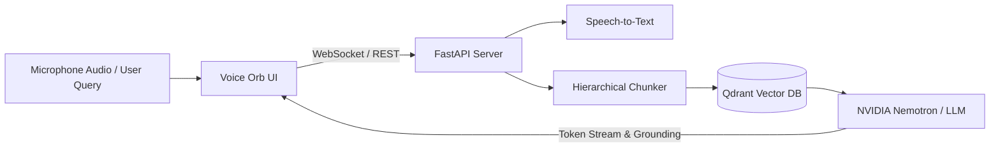

# 🎙️ Voice-Enabled RAG Search Engine with NVIDIA Nemotron & Qdrant

A production-grade, low-latency Voice RAG (Retrieval-Augmented Generation) search engine featuring real-time speech transcription, semantic passage retrieval with Qdrant vector store, NVIDIA Nemotron neural inference, and an interactive audio-reactive Voice Orb UI.

---

## 🌟 Key Features

- **🗣️ Real-time Voice Interaction**: Stream audio directly to WebSocket STT (ElevenLabs / Sarvam / Web Speech API fallback) with instant visual feedback and audio-reactive waveforms.
- **⚡ Sub-Second Retrieval**: Hierarchical semantic chunking and dense vector indexing with Qdrant vector database on MS MARCO passage collections.
- **🧠 NVIDIA Nemotron RAG Engine**: Grounded generative responses using Nemotron / LLM inference with hallucination guardrails and source citation tracking.
- **🔮 Interactive Voice Orb UI**: React 18 + TypeScript frontend with dynamic shader pulsing, audio analyzers, and live latency diagnostics.
- **☁️ Vercel Ready**: Ready for one-click deployment on Vercel with optimized static routing and configurable backend endpoints.

---

## 🚀 Quick Start

### 1. Prerequisites

- Python 3.10+
- Node.js 18+ & pnpm
- NVIDIA NIM / OpenAI API Key (for LLM inference)
- Optional: ElevenLabs / Sarvam API Key (for server STT)

### 2. Backend Setup

```bash
# Create and activate virtual environment
python -m venv .venv
source .venv/bin/activate

# Install dependencies
pip install -r requirements.txt

# Configure environment variables
cp .env.example .env # or configure keys in .env
```

Start the FastAPI server:
```bash
python server/app.py
# or: uvicorn server.app:app --host 0.0.0.0 --port 8000 --reload
```

### 3. Frontend Setup

```bash
cd frontend
pnpm install
pnpm build
pnpm build:demo
pnpm dev:demo
```
Open [http://localhost:5173](http://localhost:5173) in your browser.

---

## 🌐 Deploy to Vercel

### One-Click Vercel Deployment

1. Push your repository to GitHub.
2. Go to [Vercel Dashboard](https://vercel.com/new) and import this repository.
3. Vercel will automatically detect the root `vercel.json` and build the frontend (`frontend/demo/dist`).
4. (Optional) Set environment variables in Vercel project settings:
   - `VITE_BACKEND_URL`: Your deployed FastAPI backend URL (e.g. `https://your-backend.railway.app` or `https://your-backend.onrender.com`)
   - `VITE_BACKEND_WS_URL`: Your WebSocket endpoint (e.g. `wss://your-backend.railway.app`)

---

## 🏗️ Architecture



---

## 📁 Repository Structure

```
├── dataset/             # MS MARCO loaders & hierarchical chunkers
├── frontend/            # React + TypeScript Orb UI monorepo
│   ├── demo/            # Voice RAG interactive client app
│   └── src/             # Core orb-ui animation & adapter components
├── model_harness/       # Nemotron & LLM orchestration harnesses
├── pipeline/            # RAG pipelines, query expander & guardrails
├── server/              # FastAPI WebSocket & REST API server
├── stt/                 # ElevenLabs & Sarvam speech-to-text drivers
├── vector_store/        # Qdrant vector database engine
├── vercel.json          # Vercel deployment configuration
└── requirements.txt     # Python backend dependencies
```

---

## 📄 License

MIT License.
