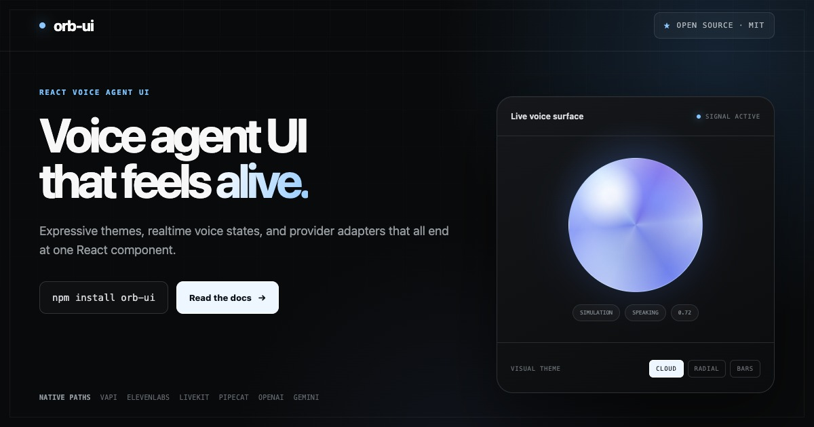

# orb-ui

**Voice agent UI that feels alive.**

Expressive, accessible React components for realtime voice agents. Connect Vapi, ElevenLabs, LiveKit, Pipecat, OpenAI Realtime, Gemini Live, or your own voice stack through one consistent UI layer.

<p align="center">
  <a href="https://orb-ui.com">
    
  </a>
</p>

<p align="center">
  <a href="https://orb-ui.com">Live demo</a> · <a href="https://orb-ui.com/docs">Documentation</a> · <a href="https://orb-ui.com/playground">Playground</a> · <a href="https://www.npmjs.com/package/orb-ui">npm</a> · <a href="https://github.com/alexanderqchen/orb-ui">Star on GitHub</a>
</p>

```jsx
import Vapi from '@vapi-ai/web'
import { Orb } from 'orb-ui'
import { createVapiAdapter } from 'orb-ui/adapters'

const vapi = new Vapi('your-public-key')
const adapter = createVapiAdapter(vapi, { assistantId: 'your-assistant-id' })

export function VoiceOrb() {
  return <Orb adapter={adapter} theme="circle" aria-label="Start voice assistant" />
}
```

## Install

Install the component package:

```bash
npm install orb-ui
```

Provider adapters are lightweight wrappers around provider SDKs. Install the SDK for the provider you use:

```bash
# Vapi
npm install orb-ui @vapi-ai/web

# ElevenLabs Conversational AI
npm install orb-ui @elevenlabs/client

# LiveKit Agents
npm install orb-ui livekit-client

# Pipecat (choose the transport used by your agent)
npm install orb-ui @pipecat-ai/client-js @pipecat-ai/small-webrtc-transport

# OpenAI Realtime uses browser WebRTC and has no additional client SDK
npm install orb-ui

# Gemini Live
npm install orb-ui @google/genai
```

> **Note:** Orb uses React hooks internally — in Next.js App Router, use it in a `'use client'` component.

## How provider adapters are created

Every provider ends at the same React API:

```jsx
<Orb adapter={adapter} theme="circle" aria-label="Start voice assistant" />
```

The only difference is how the adapter obtains a provider session:

| Provider                                                                  | Required browser setup                                                   |
| ------------------------------------------------------------------------- | ------------------------------------------------------------------------ |
| [Vapi guide](https://orb-ui.com/docs/adapters/vapi)                       | Pass a configured Vapi client plus `assistantId`                         |
| [ElevenLabs guide](https://orb-ui.com/docs/adapters/elevenlabs)           | Pass `Conversation` plus an `agentId`, signed URL, or conversation token |
| [LiveKit guide](https://orb-ui.com/docs/adapters/livekit)                 | Provide a token endpoint and optional agent name                         |
| [Pipecat guide](https://orb-ui.com/docs/adapters/pipecat)                 | Pass a configured `PipecatClient` plus its connect callback              |
| [OpenAI Realtime guide](https://orb-ui.com/docs/adapters/openai-realtime) | Return a fresh short-lived client secret from `getClientSecret`          |
| [Gemini Live guide](https://orb-ui.com/docs/adapters/gemini-live)         | Open the official Google Live session in `connect`                       |

The adapter owns provider event mapping and emits one consistent `OrbSignal`. OpenAI and Gemini
standard API keys, and LiveKit participant-token signing, stay on your server. See the
[adapter overview](https://orb-ui.com/docs/adapters/overview) for the responsibility boundary and
advanced setup shapes.

For an app-owned WebRTC, WebSocket, telephony, or speech runtime, follow the
[custom integration guide](https://orb-ui.com/docs/adapters/custom).

## Quick Start

Use orb-ui as a React voice AI component when you need a first-party provider voice UI or a custom animated voice orb for another realtime voice agent stack.

### With Vapi

```jsx
import Vapi from '@vapi-ai/web'
import { Orb } from 'orb-ui'
import { createVapiAdapter } from 'orb-ui/adapters'

const vapi = new Vapi('your-public-key')
const adapter = createVapiAdapter(vapi, { assistantId: 'your-assistant-id' })

function App() {
  return <Orb adapter={adapter} theme="circle" aria-label="Start Vapi assistant" />
}
```

### With ElevenLabs

```jsx
import { Conversation } from '@elevenlabs/client'
import { Orb } from 'orb-ui'
import { createElevenLabsAdapter } from 'orb-ui/adapters'

const adapter = createElevenLabsAdapter(Conversation, { agentId: 'your-agent-id' })

function App() {
  return <Orb adapter={adapter} theme="circle" aria-label="Start ElevenLabs assistant" />
}
```

### With LiveKit

```jsx
import { Orb } from 'orb-ui'
import { createLiveKitAdapter } from 'orb-ui/adapters/livekit'

const adapter = createLiveKitAdapter({
  tokenEndpoint: '/api/livekit-token',
  agentName: 'your-agent-name',
})

function App() {
  return <Orb adapter={adapter} theme="circle" aria-label="Start LiveKit assistant" />
}
```

The LiveKit entrypoint creates the room and token source, assigns a fresh room name, and meters both
sides of the conversation with speech-oriented analyser and smoothing defaults. Existing-room and
custom-runtime modes remain available from the advanced `orb-ui/adapters` entrypoint.

### With Pipecat

```jsx
import { PipecatClient } from '@pipecat-ai/client-js'
import { SmallWebRTCTransport } from '@pipecat-ai/small-webrtc-transport'
import { Orb } from 'orb-ui'
import { createPipecatAdapter } from 'orb-ui/adapters'

const client = new PipecatClient({ transport: new SmallWebRTCTransport(), enableMic: true })
const adapter = createPipecatAdapter(client, {
  connect: () => client.connect({ webrtcUrl: 'https://agent.example.com/api/offer' }),
})

function App() {
  return <Orb adapter={adapter} theme="circle" aria-label="Start Pipecat assistant" />
}
```

The Pipecat adapter consumes the standard RTVI event surface and meters the client media tracks as
a browser fallback, so it works with Pipecat Cloud, Daily, SmallWebRTC, and transports that emit
sparse audio-level events. See the [Pipecat guide](https://orb-ui.com/docs/adapters/pipecat).

### With OpenAI Realtime

```jsx
import { Orb } from 'orb-ui'
import { createOpenAIRealtimeAdapter } from 'orb-ui/adapters'

const adapter = createOpenAIRealtimeAdapter({
  getClientSecret: async () => {
    const response = await fetch('/api/openai-realtime-token', { method: 'POST' })
    return (await response.json()).value
  },
})
```

Create client secrets with a standard OpenAI API key on your server. See the
[OpenAI Realtime guide](https://orb-ui.com/docs/adapters/openai-realtime).

### With Gemini Live

```jsx
import { GoogleGenAI } from '@google/genai'
import { Orb } from 'orb-ui'
import { createGeminiLiveAdapter } from 'orb-ui/adapters'

const adapter = createGeminiLiveAdapter({
  connect: async (callbacks) => {
    const token = await fetch('/api/gemini-live-token', { method: 'POST' }).then((res) =>
      res.json(),
    )
    const client = new GoogleGenAI({
      apiKey: token.value,
      httpOptions: { apiVersion: 'v1alpha' },
    })
    return client.live.connect({ model: token.model, config: token.config, callbacks })
  },
})
```

Mint one-use Gemini Live tokens on your server. See the
[Gemini Live guide](https://orb-ui.com/docs/adapters/gemini-live) for the matching server config that
disables automatic activity detection. The adapter handles client-side turn detection by default.

The examples above show the intended happy paths. Transport overrides, custom browser runtimes,
existing-session modes, and audio calibration hooks are optional and documented in the individual
adapter guides.

### Controlled mode (custom integration)

```jsx
import { Orb } from 'orb-ui'
import { useState } from 'react'

function App() {
  const [state, setState] = useState('idle')
  const [volume, setVolume] = useState(0)

  return <Orb state={state} volume={volume} theme="circle" />
}
```

Use `signal` when your integration has separate input and output levels:

```jsx
import { Orb } from 'orb-ui'

function App() {
  return <Orb signal={{ state: 'speaking', outputVolume: 0.7 }} theme="circle" />
}
```

### External session controls

Keep the orb as a passive visual when start and stop controls belong elsewhere in your layout.
Provider adapters already expose the matching lifecycle methods.

```jsx
function VoiceExperience({ adapter }) {
  return (
    <>
      <Orb adapter={adapter} theme="cloud" interactive={false} />
      <button onClick={() => void adapter.start?.()}>Start conversation</button>
      <button onClick={() => void adapter.stop?.()}>End conversation</button>
    </>
  )
}
```

## Themes

| Theme    | Description                                                                   |
| -------- | ----------------------------------------------------------------------------- |
| `radial` | Four-lobe radial field with input-reactive rim and output-reactive twisting.  |
| `cloud`  | Atmospheric sphere with inverse listening scale and faster speaking motion.   |
| `debug`  | State + volume display with start/stop. Use to verify your integration works. |
| `circle` | Pulsing circle that reacts to volume.                                         |
| `bars`   | Five bars that animate with voice.                                            |

When an adapter or `onStart`/`onStop` handler is provided, visual themes include keyboard-accessible `<button type="button">` controls. `radial` places its phone control below the artwork while the other clickable themes use the visual itself. Pass `interactive={false}` to keep the theme passive and call `adapter.start()` or `adapter.stop()` from external controls instead.

The radial phone control uses a small cutout that defaults to white. Match it to the surface behind
the orb with the typed style variable:

```tsx
<Orb adapter={adapter} theme="radial" style={{ '--orb-ui-radial-control-surround': '#101010' }} />
```

## Props

| Prop          | Type                                                   | Default   | Description                                             |
| ------------- | ------------------------------------------------------ | --------- | ------------------------------------------------------- |
| `theme`       | `'debug' \| 'circle' \| 'bars' \| 'cloud' \| 'radial'` | `'debug'` | Visual theme                                            |
| `signal`      | `OrbSignal`                                            | —         | Rich controlled signal with state/input/output volume   |
| `state`       | `OrbState`                                             | `'idle'`  | Conversation state (controlled mode)                    |
| `volume`      | `number`                                               | `0`       | Audio volume, 0–1. Overrides signal/adapter volume.     |
| `adapter`     | `OrbAdapter`                                           | —         | Provider adapter (manages signal updates automatically) |
| `size`        | `number`                                               | `200`     | Size in pixels                                          |
| `className`   | `string`                                               | —         | Optional class name for the rendered theme              |
| `style`       | `OrbStyle`                                             | —         | Inline styles, including radial control surround color  |
| `disabled`    | `boolean`                                              | `false`   | Disables clickable themes and debug start/stop controls |
| `interactive` | `boolean`                                              | `true`    | Allows the theme control to start and stop a session    |
| `aria-label`  | `string`                                               | generated | Accessible label for clickable visual themes            |
| `onStart`     | `() => void`                                           | —         | Custom start handler (overrides adapter.start())        |
| `onStop`      | `() => void`                                           | —         | Custom stop handler (overrides adapter.stop())          |

## States

`idle` · `connecting` · `listening` · `thinking` · `speaking` · `error`

## Supported Providers

| Provider                                                                  | Adapter                                                               |
| ------------------------------------------------------------------------- | --------------------------------------------------------------------- |
| [Vapi](https://vapi.ai)                                                   | `createVapiAdapter` from `orb-ui/adapters`                            |
| [ElevenLabs](https://elevenlabs.io/conversational-ai)                     | `createElevenLabsAdapter` from `orb-ui/adapters`                      |
| [LiveKit](https://livekit.io)                                             | `createLiveKitAdapter` from `orb-ui/adapters`                         |
| [Pipecat](https://pipecat.ai)                                             | `createPipecatAdapter` from `orb-ui/adapters`                         |
| [OpenAI Realtime](https://developers.openai.com/api/docs/guides/realtime) | `createOpenAIRealtimeAdapter` from `orb-ui/adapters`                  |
| [Gemini Live](https://ai.google.dev/gemini-api/docs/live-api)             | `createGeminiLiveAdapter` from `orb-ui/adapters`                      |
| Custom                                                                    | Use controlled mode — pass `signal`, or `state` and `volume` directly |

## Development

```bash
git clone https://github.com/alexanderqchen/orb-ui.git
cd orb-ui
pnpm install

# Build the library
pnpm build

# Run demo locally
pnpm dev:demo
```

Useful maintenance commands:

```bash
pnpm check        # format check, lint, typechecks, tests, library build, demo build
pnpm format       # format repo files
pnpm changeset    # add release notes for a user-facing package change
```

Releases are managed with Changesets. Merging a Changesets version PR publishes
`orb-ui` to npm from GitHub Actions using npm trusted publishing.

## License

MIT © [Alexander Chen](https://github.com/alexanderqchen)
